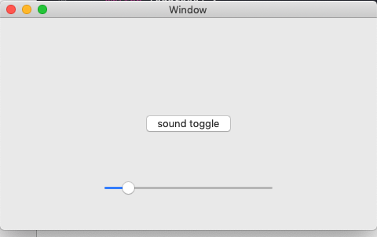

# AudioKit extension example (MacOS)

Working implementation of an application using a custom AudioKit extension, as described here: https://github.com/AudioKit/AudioKit/tree/master/Developer/macOS/ExtendingAudioKit

Simplified the original example, using a HelloWorld (2 sines) as the host app instead. And I did have to fiddle with the build settings a little.

*Usage for this repo :* to jump start more complex AudioKit based apps that need custom DSP code written in C++

